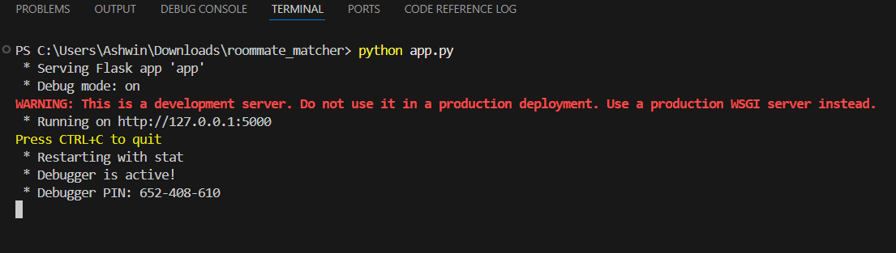
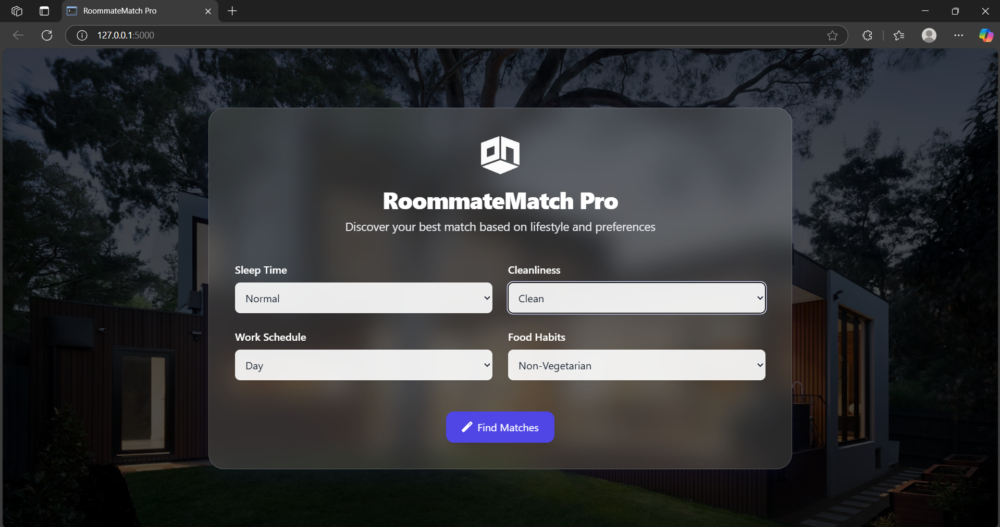
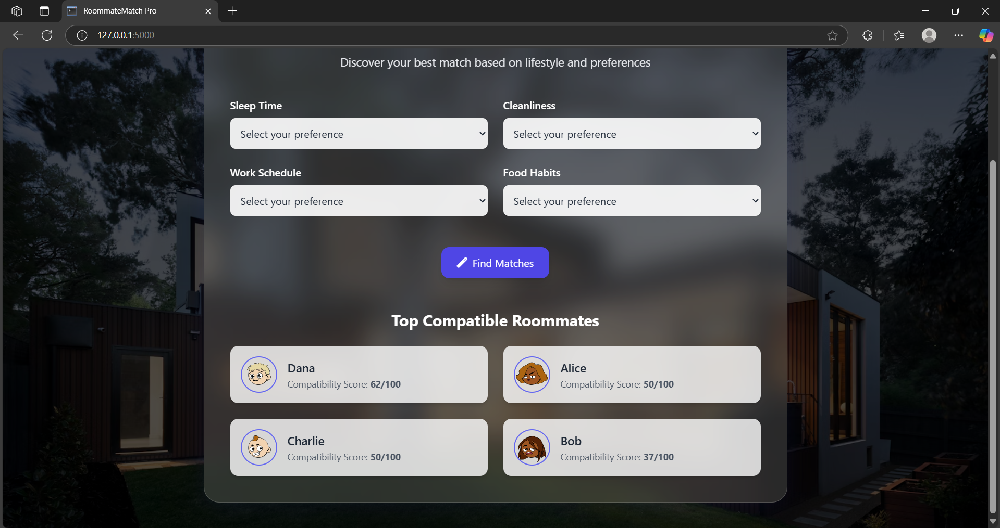

# 🏡 Roomsync
Roomsync Pro is a simple and smart web app that helps people find ideal roommates based on lifestyle compatibility. It was developed as part of the **ApanaGhr Internship Mini Project**.

---

## 🌟 What It Does

- Collects basic lifestyle preferences (like sleep time, cleanliness, food habits, etc.)
- Instantly shows mock roommate matches
- Each match includes a score, profile, and habits for comparison
- No login or signup required — just click and match!

---

## 🛠 Technologies Used

- HTML
- Tailwind CSS
- JavaScript
- DiceBear Avatars (for profile images)
- Font Awesome (for icons)

---

## 🚀 How to Run

1. Install VS code and Open it . 
2. select the project folder and open it .
3. open **Terminal** and Enter python app.py .
4. click **http://127.0.0.1:5000** .

4. It will open into the web browser . 
3. Fill out the form and click **Find Matches**

4. View your top roommate matches with scores

---

## 🎯 Project Goal

This project was created to:
- Apply real-world web development skills
- Simulate roommate compatibility logic
- Deliver a clean, user-friendly interface
- Learn and grow through the **ApanaGhr Internship**

---

## 🔮 Future Improvements

- Add real AI/ML-based matching system
- Store data using a backend (Firebase or Node.js)
- User authentication (login/signup)
- Save match history
- Add themes like Dark Mode

---

## 👨‍💻 Developed By

**B.Ashwin kumar**  
AI & ML Student | VEL University  
Built with passion during Mini project for the **ApanaGhr Internship**

---

## 📄 License

This project is open-source and available under the [MIT License](LICENSE).
